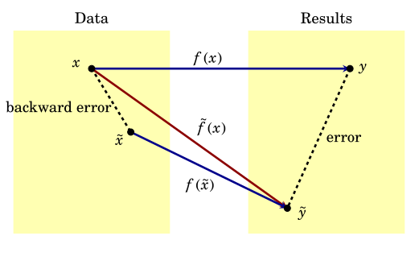

# Introduction

**Learning objectives:**

- Pros and cons of `julia` vs MATLAB/Python
- Definition of floating-point numbers
- Various measures of accuracy 
- Condition numbers of various operations
- Algorithms
- Functions in `julia`
- Algorithm stability

## Preface {-}

- MATLAB first entered scene 
- SciPy, NumPy, and Matplotlib offered free, open, and integrated alternative
- Enter Julia: a solution to performance deficiencies with all benefits

## Why (teach) Julia? {-}

Julia pros over MATLAB:

- unicode characters = looks like math
- effortless functions defined in scripts
- broadcast syntax for elementwise apply
- comprehensions
- easy to define keyword and optional function arguments
- part of Jupyter
- free and open-source
- skills more likely to transfer

## Julia cons {-}

Tradeoffs for not using MATLAB:

- stricter, more verbose, more error prone (BUT results easier to predict)
- more installation effort
- slim documentation and internet help
- not yet a good companion desktop IDE and debugger
- just-in-time compilation may require noticeable time to load

## What to expect from this book {-}

- exhibit decent style
- avoid bad habit
- vectors and matrices start from index 1
- `Plots` for graphics
- packages for real applications

It will not cover a defining feature: *multiple dispatch*

## Condition number and unstable algorithms {-}

**Condition number**: number describing sensitivity of an operation to error in finite-precision; larger condition numbers indicate more sensitivity  

**Unstable**: describes an algorithm that allows for errors in numerical computation to grow enormously

## Floating-point numbers {-}

A set of numbers consistent of zero and all numbers of the form:

$$
\pm (1 + f) \times 2^n,
$$
where $n$ is an integer called the **exponent**, and $1+f! is the **mantissa** or **significand**, in which
$$
f = \sum_{i=1}^d b_i2^{-i}, \quad b_i \in \{0,1\},
$$
for a fixed integer *d* called the binary **precision**

**In base 10** we get scientific notation with $d+1$ sig. digits

$$
\pm(b_0 + \sum_{i=1}^d b_i10^{-i}) \times 10^n = \pm(b_0 b_1 b_2 \cdots b_d) \times 10^n,
$$
where $b_i \in \{0,1,...,9\}$ and $b_0 \neq 0$.

## Machine epsilon {-}

For a floating-point set with *d* binary digits of precision, **machine epsilon** is:

$$
\epsilon_{mach} = 2^{-d}.
$$

- This is the smallest floating-point number that is greater than 1.  
- It gives a bound on the relative error of rounding a real number to the nearest float

## Precision and accuracy {-}

**Precision**: floating-point numbers always have $d$ binary digits, resolution bounded by machine epsilon  

**Absolute accuracy**: $| \text{approx}(x) - x |$  

**Relative accuracy**: $\frac{| \text{approx}(x) - x |}{|x|}$  

**Number of accurate digits**: $-\log_{10} \left\vert \frac{\text{approx}(x) - x}{x} \right\vert$

## Demo {-}

```{julia, eval = FALSE}
p = 22/7
float(π)
acc = abs(p-π)
println("absolute accuracy = $acc")
println("relative accuracy = $(acc/π)")
```

## Double Precision {-}

64 binary bits per floating-point number: 52-bit **significand** and 11 bit **exponent**. 

$$
\epsilon_{mach} = 2^{-52} \approx 2.2 \times 10^{-16}
$$

- roughly gives about 16 decimal digits (not places) 
- limits range of **exponent** between -1022 and 1023
- Values greater than $2 \times 10^{308}$ result in *overflow* and an `Inf`
- *underflow* results in a 0
- `NaN` result of undefined arithmetic operations

Relative `julia` functions: `sign()`, `exponent()`, `significand()`, `bitstring()` 

> `julia` doesn't allow indexing by type float; when force coercian of noninteger floats to integers, get an `InexactValue` error.

## Floating-point arithmetic {-}

- Machines do arithmetic with floating-point numbers and return floating-point numbers
- Elementary machine arithmetic operations results in relative error bounded by $\epsilon_{mach}$
- Sometimes leads to disturbing results (associativity breaks demo)

> observation: with floating points, we should not expect two mathematically equivalent results be equal, only relatively close

## Problems and conditioning {-}

**Subtractive cancellation**: loss of accuracy when two numbers add/subtract to a result much smaller in magnitude

- original number of digits become meaningless
- computer/algorithm agnostic

## Condition numbers, cont. {-}

$$
\kappa_f(x) = \lim_{\epsilon \rightarrow 0}\frac{|f(x) - f(x(1+\epsilon))|}{|\epsilon f(x)|} = \left\vert \frac{xf'(x)}{f(x)} \right\vert
$$

- relative error of output to relative error of input
- computer/algorithm agnostic

Condition number of simple addition $f(x) = x - c$:

$$
\kappa_f(x) =  \left\vert \frac{x}{x-c} \right\vert
$$

- Condition number of constant multiplication is 1 $\leftarrow$ no potential for cancellation error
- **Ill-conditioned**: problem with large rel. condition number
- Rel. condition number < 1 is no different than equivalent to 1 in practice
- see text for table

## Polynomial roots: {-}

- Roots of polynomials are ill-conditioned wrt changes in polynomial coefficients
- Condition number can be arbitrarily large
- Cases of repeated roots have infinite condition number

> `julia` demo: as compared to R, do not need to explicitly use multiplication operation, multiple outputs

## Algorithms {-}

**Algorithm**: complete set of instructions for transforming data into a result  

*pseudocode*: mixture of math, words, and computer-style instructions

## Horner's algo {-}

```{julia, eval = FALSE}
"""
    horner(c,x)

Evaluate a polynomial whose coefficients are given in ascending
order in `c`, at the point `x`, using Horner's rule.
"""
function horner(c,x)
    n = length(c)
    y = c[n]
    for k in n-1:-1:1
        y = x*y + c[k]
    end
    return y
end
```

- square brackets accesses elements of vector
- vector index starts at 1, so n is last
- return terminates function (book mentions this style is discouraged... alternative?)
- quicker implementations in `Polynomials` package

## Writing your own `julia` functions {-}

- functions can be defined in `.jl` files, command line, or notebooks
- scoping is as expected

**Verbose**:

- start with `function` keyword followed by function name and input args
- `end` is a keyword that tells the function to return most recent statement result if no `return` 

```{julia, eval = FALSE}
function myfun(x)
    s = sin(x)
    return exp(s)
end
```

**Compact**:

```{julia, eval = FALSE}
myfun(x) = exp(sin(x))
```

**Anonymous/lambda function**

```{julia, eval = FALSE}
plot( x->exp(sin(x)), 0, 6 )
```

## Stability {-}

**unstable algorithm** : an algorithm with error exceeding error expected from conditioning

- quadratic formula is *unstable* in finite precision computation
- sensitivity of a problem/step is governed by condition number, but sensitivity of algorithm depends on condition numbers of individual steps

**Backward error**: a measure of the change in original data that reproduces the result of the algorithm

$$
\frac{| \tilde{x} - x |}{|x|}
$$
```{r, echo = FALSE}

```

If an algorithm always produces small backward errors, then it is stable. (converse not always true)

## Meeting Videos {-}

### Cohort 1 {-}

`r knitr::include_url("https://www.youtube.com/embed/URL")`

<details>
<summary> Meeting chat log </summary>

```
LOG
```
</details>
