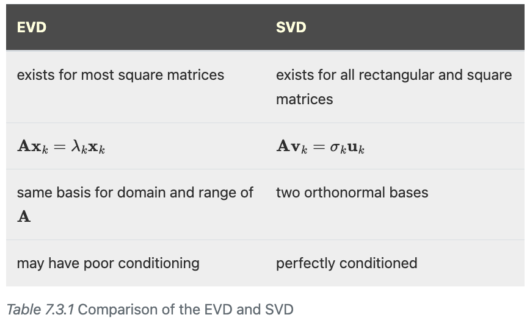

```{r setup_ch7, echo = FALSE, warning = FALSE, message = FALSE}
knitr::opts_chunk$set(
  eval = FALSE,
  message = FALSE,
  warning = FALSE
)
```

```{r, echo = FALSE}
library(JuliaCall)
JuliaCall::julia_setup(JULIA_HOME = "/Applications/Julia-1.9.app/Contents/Resources/julia/bin")
```

```{julia}
using FundamentalsNumericalComputation
default(legend = false)
```

# Matrix analysis

**Learning objectives:**

-   Introduce language to characterize matrices
-   Show common matrix decompositions: EVD and SVD
-   Discuss dimension reduction through the SVD

## What's new in Julia {.unnumbered}

-   `graphplot()` from `GraphRecipes` library
-   `sum( , i)` method for graphs/adj. matrices
-   RGB type
-   Functions for images: `red()`, `green()`, `blue()`, `Gray()`
-   Imaginary number `1im` and component `imag()`
-   EVD with `eigvals()` and `eigen()`
-   SVD with `svd()`
-   No plotting box with `frame=:none`
-   loading Julia data file `@load "voting.jld2" A;`
    -   I did not succeed at this
-   `heatmap()`: plot a heatmap
-   `reverse()`: reverse order of object, can specify dimension

## From matrix to insight

-   Many data types can be represented by matrices: tables, graphs, images
-   For a graph with adjacency matrix **A**, **A**$^k$ represents the number of ways to walk from $i$ to $j$ in $k$ steps

**Exercise 5.1.5**

```{julia}
datafile = download("https://tobydriscoll.net/fnc-julia/_static/resources/actors.jld2")
@load datafile A
```

What is the maximum number of actors appearing in any one movie?\
Maximum row sum.\
`findmax(itr) -> (x, index)`

```{julia}
A[1,:];
sum(A[1,:]);

s = [sum(A[i,:]) for i = 1:size(A,1)];
findmax(s)
```

How many actors appeared in exactly three movies?\
Find how many column sums equal 3

```{julia}
s2 = [sum(A[:,i]) for i = 1:size(A,2)];

sum(@. s2 == 3)
```

Define **C** = **A**$^T$**A**. How many nonzero entries does **C** have? What is the interpretation of **C**?\
**C** is an actor by actor matrix where the nonzero entries correspond to how many movies two actors have been in together or on the diagonal it is how many movies an actor has been in.

```{julia}
C = A'*A;
C[1:5, 1:5]

sum(@. C > 0)
reduce(*, size(C))
```

## Eigenvalue Decomposition

Terms for complex matrices:

-   **adjoint** or *hermitian* == transpose
-   **self-adjoint** or *hermitian* == symmetric
-   **unitary** == orthogonal

Key theory:

-   EVD analytically simplifies to a polynomial root-finding problem based on the determinant
-   Matrices are similar if they have the same eigenvalues
-   Matrix powers are defined through powers of the eigenvalues
-   **Bauer-Fike theorem**: eigenvalues can be perturbed by a factor of the the eigenvector matrix condition number more than the matrix perturbation
    -   introduces the concept of a **normal** matrix (condition number = 1)
-   Numerically EVD beyond scope of book but related to matrix powers

**Exercise 5.2.8**

Eigenvalues of random matrices and their perturbations can be very interesting.

Define A and produce scatter plot in complex plane

```{julia}
A = randn(60,60);
lambda_A = eigvals(A);

scatter(real(lambda_A), imag(lambda_A), aspect_ratio=1, 
        color=:red, markershape=:diamond, leg=:none)
```

Let E by another random matrix to perturb A. Plot eigenvalues on top. Repeat for 100 values of E.

```{julia}
plt = scatter(real(lambda_A), imag(lambda_A), aspect_ratio=1, 
        color=:red, markershape=:diamond, leg=:none);


for i in 1:100
    E = randn(60,60);
    lambda_tmp = eigvals(A+0.05.*E);
    scatter!(real(lambda_tmp),imag(lambda_tmp),m=1,color=:blue,
             leg=:none)
end

plt
```

Let T be the upper triangle of A. Repeat with T.

```{julia}
T = triu(A);
lambda_T = eigvals(T);

plt = scatter(real(lambda_T), imag(lambda_T), aspect_ratio=1, 
        color=:red, markershape=:diamond, leg=:none)


for i in 1:100
    E = randn(60,60);
    lambda_tmp = eigvals(T+0.05.*E);
    scatter!(real(lambda_tmp),imag(lambda_tmp),m=1,color=:blue,
             leg=:none)
end

plt
```

Compute some condition numbers and apply Theorem 7.2.9.

```{julia}
cond(A)
cond(T)
```

## Singular Value Decomposition

Key theory:

-   unlike EVD, exists for any matrix
-   singular values are unique, values are not
-   eigenvalues of **A**$^*$**A** are squares of singular values of **A**
    -   eigenvectors are related to right singular vectors
-   for $m \times n$ matrices with $m > n$, the last $m-n$ singular values are 0 and gives a thin form
-   2-norm of a matrix is the first singular value
-   condition number is ratio between first singular value and $\min \{m,n\}$th singular value

```{r}

```

**Exercise 7.3.3**

Let x be a vector of 1000 equally spaced points between 0 and 1. Suppose **A**$_n$ is the $1000 \times n$ matrix whose $(i,j)$ entry is $x_i^{j-1}$ for $j = 1,...,n$

(a) Print out singular values of **A**$_1$, **A**$_2$, and **A**$_3$

```{julia}
x = range(0, 1.0, length = 1000);
A1 = [x[i]^(j-1) for i = 1:1000, j = 1];
A2 = [x[i]^(j-1) for i = 1:1000, j = 1:2];
A3 = [x[i]^(j-1) for i = 1:1000, j = 1:3];

svdvals(A1)
svdvals(A2)
svdvals(A3)
```

(b) Make a log-linear plot of the singular values of **A**$_40$

```{julia}
A40 = [x[i]^(j-1) for i = 1:1000, j = 1:40];
s = svdvals(A40);

plot(s, leg=:none, yaxis=(:log10,"Log Singular Values"))
```

(c) Repeat b after converting x to type `Float32`

```{julia}
A40 = [Float32(x[i])^(j-1) for i = 1:1000, j = 1:40];
s = svdvals(A40);

plot(s, leg=:none, yaxis=(:log10,"Log Singular Values"),
     title = "Single Precision")
```

(d) Having seen (c), which singular values of (b) do you suspect may be incorrect?

## Symmetry and definiteness

Key theory:

-   spectral decomposition for hermitian (symmetric) matrix: **A** = **VDV**$^{-1}$
-   hermitian matrices are normal with condition number 1
-   SVD of hermitian matrices: : **A** = (**VT**)\|**D**\|**V**$^{*}$
-   Rayleigh quotient for quadratics shows a good estimate of eigenvector is even better estimate of eigenvalue
-   hermitian positive definite: all quadratics are greater than 0 (all eigenvalues are positive)

**Exercise 7.4.1**

Thanks to spectral decomposition, the eigenvalue problem for hermitian matrices is easier than for general matrices.

(a) Let **A** be a $1000 \times 1000$ random real matrix, and **S** = **A** + **A**$^T$. Time the `eigvals` function for **A** and then for **S**.

```{julia}
A = randn(1000,1000);
S = A + A';

@elapsed eigvals(A)
@elapsed eigvals(S)
```

(b) Perform the experiment from part (a) on $n \times n$ matrices for $n = 200, 300, ..., 1600$. Plot running time as a function of $n$ for both matrices on a single log-log plot. Is the ratio of running times roughly constant, or does it grow with $n$?

```{julia}
n = 200:100:1600;
times_a = [];
times_s = [];

for n in n
  A = randn(n,n);
  S = A + A';
  push!(times_a, @elapsed eigvals(A));
  push!(times_s, @elapsed eigvals(S));
end

scatter(times_a, times_s, xaxis=(:log10, "A times"),
  yaxis=(:log10, "S times"))  
```

## Dimension Reduction

Key theory:

$$\mathbf{A}_k = \sum_{i=1}^k \sigma_i \mathbf{u}_i \mathbf{v}_i^T = \mathbf{U}_k \mathbf{S}_k \mathbf{V}_k^T$$

-   defines a rank $k$ approximation with the first $k$ important contributions
-   compression of matrices
-   interpretation of the fraction of variance captured as sum of square singular values

**Polling Demo**

```{julia}
datafile = download("https://tobydriscoll.net/fnc-julia/_static/resources/voting.jld2")

@load datafile A;

heatmap(A,color=:viridis,
    title="Votes in 111th U.S. Senate",xlabel="bill",ylabel="senator")
```

```{julia}
U,σ,V = svd(A)
τ = cumsum(σ.^2) / sum(σ.^2)
scatter(τ[1:16], xaxis=("k"), yaxis=(L"\tau_k"), 
    title="Fraction of singular value variance")
```

```{julia}
scatter( U[:,1],label="",layout=(1,2),
    xlabel="senator" ,title="left singular vector")
scatter!( V[:,1],label="",subplot=2,
    xlabel="bill",title="right singular vector")
```

**Exercise 7.5.3**

find the rank-1 matrix closest to **A**

(a) 

```{julia}
A = [1. 5.; 5. 1.]

U, sigma, V = svd(A);
A1 = U[:,1]*sigma[1,1]*V[:,1]'
sigma.^2 ./ sum(sigma.^2)
```

(b) 

```{julia}
A = [1. 5.; 0. 1.]

U, sigma, V = svd(A);
A1 = U[:,1]*sigma[1,1]*V[:,1]'
sigma.^2 ./ sum(sigma.^2)
```

**Exercise 7.5.5**

Following Demo 7.5.2 as a guide, load the "mandrill" test image and convert it to a matrix of floating-point pixel grayscale intensities. Using the SVD, display as images the best approximations of rank 5, 10, 15, and 20.

```{julia}
img = testimage("mandrill");
A = @. Float64(Gray(img))
plot(Gray.(A), frame =:none)
```

```{julia}
U, S, V = svd(A);

plt = plot(layout=(2,2),frame=:none,aspect_ratio=1,titlefontsize=10);
for i in 1:4
    k = 5i
    Ak = U[:,1:k]*diagm(S[1:k])*V[:,1:k]'
    plot!(Gray.(Ak),subplot=i,title="rank = $k")
end
plt
cumsum(S.^2) / sum(S.^2)    
```

## Meeting Videos {.unnumbered}

### Cohort 1 {.unnumbered}

`r knitr::include_url("https://www.youtube.com/embed/URL")`

<details>

<summary>Meeting chat log</summary>

```         
LOG
```

</details>
